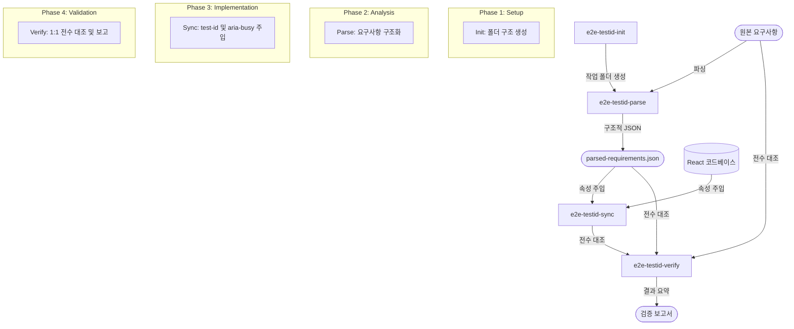

# E2E Test-ID Sync Plugin

이 플러그인은 React(TSX/JSX) 프로젝트에서 E2E 테스트를 위해 `data-testid` 및 `aria-busy` 속성을 주입하고, 요구사항 대비 정합성을 검증하는 도구입니다.

## 전체 워크플로우 (Flow)

플러그인은 다음과 같은 4단계 프로세스로 동작합니다:

### 1단계: 초기화 (Init)
- **스킬**: `e2e-testid-init`
- **역할**: 오늘 날짜의 작업 디렉토리(`.docs/e2e/{YYYYMMDD}/`)를 생성하고 환경을 점검합니다.

### 2단계: 요구사항 파싱 (Parse)
- **스킬**: `e2e-testid-parse`
- **역할**: `.docs/e2e/{YYYYMMDD}/` 폴더에 배치된 PDF/원본 요구사항을 분석하여 구조화된 `parsed-requirements.json`을 생성합니다.

### 3단계: 코드 주입 (Sync)
- **스킬**: `e2e-testid-sync`
- **역할**: 파싱된 요구사항을 바탕으로 실제 React 컴포넌트에 `data-testid`와 `aria-busy` 속성을 주입합니다.

### 4단계: 검증 및 요약 (Verify)
- **스킬**: `e2e-testid-verify`
- **역할**: 삽입된 결과물을 PDF 원본과 1:1로 전수 대조하여 `summary.md`와 `result.json` 리포트를 생성합니다. (Sync 작업 완료 후 자동 실행되거나 단독 실행 가능)

---

## 사용 방법 (Usage)

### 1. 전체 프로세스 시작
"E2E 작업 시작해줘" 또는 "테스트아이디 주입 준비해줘"라고 요청하면 초기화부터 순차적으로 안내합니다.

### 2. 단계별 실행
특정 단계만 수행하고 싶을 때 다음과 같이 명령할 수 있습니다:
- **파싱**: "PDF 요구사항 읽어줘"
- **동기화**: "코드에 testid 주입해줘"
- **검증**: "삽입 결과 정리해줘" 또는 "결과 요약해줘"

## 주요 디렉토리 구조
- `.docs/e2e/{YYYYMMDD}/`: 해당 날짜의 모든 산출물 (JSON, 요약 보고서 등)이 저장됩니다.
- `apps/data-center/src/`: 주입 대상 프로젝트 소스 코드 경로입니다.

## 서브에이전트
- `e2e-parser`: PDF 구조 분석 담당
- `e2e-listing`: 코드 요소 탐색 및 매칭 담당
- `e2e-injector`: 실제 코드 수정 및 주입 담당
- `e2e-verifier`: 최종 1:1 대조 및 보고서 생성 담당
