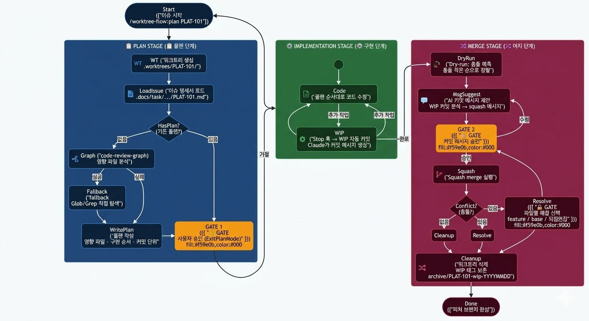

# worktree-flow

> Claude Code에서 이슈 단위 병렬 개발을 완전 자동화하는 플러그인

이슈 키 하나로 워크트리 생성 → AI 플랜 수립 → 코드 구현 → WIP 자동 커밋 → Squash merge까지, 개발 워크플로우 전 구간을 Claude가 직접 관리합니다.

---

## 왜 worktree-flow인가

### 문제: 브랜치 전환의 비용

여러 이슈를 동시에 작업할 때 `git stash` + `git checkout`의 반복은 컨텍스트를 끊고 실수를 유발합니다. 작업 중인 내용을 임시로 치워두고, 돌아올 때 다시 펼쳐야 하는 이 흐름 자체가 생산성을 갉아먹습니다.

### 해결: 이슈별 격리된 워크트리

git worktree는 하나의 레포에서 여러 작업 디렉토리를 동시에 유지합니다. worktree-flow는 이 기능을 Claude Code의 스킬 시스템과 연결해, 이슈 키만 입력하면 격리 환경 생성부터 구현까지 자동으로 처리합니다.

---

## 핵심 기능

### 1. AI 기반 영향 범위 분석 플랜

`/worktree-flow:plan PLAT-101`을 실행하면:

1. 이슈 명세서에서 변경 예상 파일·컴포넌트·함수명 키워드를 추출
2. **code-review-graph** MCP 도구로 코드 의존성 그래프를 탐색해 실제 영향 파일 목록을 확보
3. 영향 파일 기준으로 필요한 파일만 읽어 플랜을 작성

플랜 형식:

```
### 영향 파일
| 파일 | 변경 유형 | 이유 |
|------|----------|------|

### 구현 순서
1. `src/api/order.ts` — 페이지네이션 파라미터 추가

### 예상 커밋 단위
- `feat(PLAT-101): 주문 API 페이지네이션`

### 검토 포인트
- [ ] 기존 클라이언트 호환성 확인
```

플랜 확인 후 사용자가 승인해야만 코드 수정이 시작됩니다. **ExitPlanMode 게이트**로 구현 시작 전 반드시 사람의 승인을 받는 구조입니다.

### 2. WIP 자동 커밋 — Claude 응답이 끝날 때마다

`Stop` 훅으로 Claude가 응답을 마칠 때마다 워크트리의 변경사항을 자동으로 커밋합니다.

커밋 메시지도 Claude가 직접 생성합니다:

```
WIP(feat/PLAT-101--wt-PLAT-101): 주문 목록 API에 cursor 파라미터 추가

요구사항: 무한 스크롤 지원을 위해 커서 기반 페이지네이션 필요
작업내용: GET /orders에 cursor, limit 쿼리 파라미터 추가, 응답에 nextCursor 포함
특이사항: 기존 page 파라미터와 하위 호환 유지
```

단순 "파일 N개 변경"이 아니라 **왜 바꿨는지, 무엇을 바꿨는지, 어떤 결정을 했는지**를 담습니다. 나중에 WIP 커밋만 보고도 작업 맥락을 복원할 수 있습니다.

메인 리포는 자동으로 감지해 스킵합니다. 워크트리에서만 동작합니다.

### 3. 충돌 예측 기반 Squash merge

`/worktree-flow:merge feat/PLAT-sprint3`을 실행하면:

```
머지 대상: 3개 워크트리
┌──────────┬────────┬──────────────────────────┐
│ 이슈     │ WIP수  │ 충돌 예상 파일            │
├──────────┼────────┼──────────────────────────┤
│ PLAT-101 │  5개   │ (없음)                   │
│ PLAT-102 │  3개   │ src/api/order.ts         │
│ PLAT-103 │  8개   │ (없음)                   │
└──────────┴────────┴──────────────────────────┘
머지 순서: PLAT-101 → PLAT-103 → PLAT-102 (충돌 적은 순)
```

실제 merge --squash를 dry-run으로 먼저 실행해 충돌 파일을 예측하고, **충돌이 적은 순서로 자동 정렬**합니다. 충돌이 발생하면 파일별로 `feature / base / 직접편집` 중 선택하는 인터랙티브 해결 흐름으로 넘어갑니다.

### 4. WIP 히스토리 보존

Squash merge 후 워크트리 브랜치는 삭제되지만, WIP 커밋 히스토리는 태그로 보존됩니다:

```
archive/feat/sprint3/PLAT-101-wip-20260326
```

깔끔한 피처 브랜치 히스토리와 복원 가능한 작업 흔적을 동시에 유지합니다.

---

## 구조적 특이사항

### 스크립트와 Claude의 역할 분리

모든 git 조작은 Python 스크립트가 담당하고, Claude는 스크립트 출력을 해석해 사용자에게 전달합니다. Claude가 직접 `git merge`나 `git reset`을 실행하는 것을 **에이전트 정의 수준에서 금지**합니다.

```
exit 0 → 다음 스텝 진행
exit 1 → reason 그대로 출력 후 STOP (우회 금지)
exit 2 → 충돌 해결 프로세스 진입 (merge 전용)
```

스크립트가 실패하면 Claude는 "어차피 같은 결과"라 판단하고 넘어가지 않습니다. 스텝 건너뜀 자체를 금지하는 에이전트 규칙이 있습니다.

### GATE 패턴 — 사람의 확인 없이 되돌리기 어려운 작업은 실행 안 함

- 플랜 수립 후 구현 시작 전: `ExitPlanMode` 게이트
- 머지 전 커밋 메시지 확인: `AskUserQuestion` 게이트
- 충돌 파일 처리 방식: 파일마다 `AskUserQuestion` 게이트

자동화하되, 되돌리기 어려운 시점에는 반드시 사람이 개입합니다.

### 플랜 재사용

같은 이슈로 재진입하면 저장된 플랜을 먼저 보여주고 `yes / 재플랜 / 수정 {내용}` 중 선택하게 합니다. 세션이 끊겨도 플랜 컨텍스트가 유지됩니다.

### code-review-graph 연동 — Fallback 포함

코드 의존성 그래프가 없으면 Claude가 직접 Glob/Grep으로 탐색하는 fallback이 있어 그래프 없이도 동작합니다. 그래프가 있을 때는 `semantic_search_nodes_tool` → `get_impact_radius_tool` 순서로 연쇄 호출해 변경 파일의 의존 범위를 2-hop까지 추적합니다.

---

## 워크플로우

```
/worktree-flow:init               # 최초 1회: 의존 플러그인 확인 및 그래프 빌드

/worktree-flow:plan PLAT-101      # 워크트리 생성 → 플랜 수립 → 사용자 승인 → 구현
/worktree-flow:plan PLAT-102      # 동시에 다른 이슈도 작업 가능 (별도 워크트리)

/worktree-flow:status             # 활성 워크트리 현황 확인

/worktree-flow:merge feat/sprint3 # 충돌 예측 → 커밋 메시지 제안 → 승인 → squash merge → 정리
```



---

## 디렉토리 구조

```
.worktrees/
└── PLAT-101/           ← 워크트리 경로 (feat/sprint3--wt-PLAT-101 브랜치)
```

머지 후 WIP 히스토리는 git 태그로 보존됩니다 (파일시스템 폴더 아님):

```
# 태그 조회
git tag --list 'archive/feat/sprint3/*'

archive/feat/sprint3/PLAT-101-wip-20260326
archive/feat/sprint3/PLAT-102-wip-20260326
```

---

## 롤백 및 복원 (미구현 — 아이디어)

### 배경

squash merge 후 워크트리 브랜치는 삭제되지만, `archive/{피처}/{이슈키}-wip-{날짜}` 태그가 WIP 커밋 전체를 보존한다. 이 태그를 활용해 특정 이슈를 롤백하고 재작업하는 흐름을 자동화할 수 있다.

### 예상 흐름

```
# main에서 피처 revert (merge --no-ff였다면)
git revert -m 1 <피처 merge 커밋>

# 피처 브랜치 복원 (삭제됐다면 merge 커밋의 parent 2에서 재생성)
git checkout -b feat/sprint3 <merge커밋의 parent2>

# 수정할 이슈만 워크트리 복원 (restore 스킬)
/worktree-flow:restore PLAT-101
→ archive/feat/sprint3/PLAT-101-wip-날짜 태그 목록 표시
→ 선택한 태그에서 브랜치 생성 + git worktree add
→ /worktree-flow:plan PLAT-101 으로 재작업
→ /worktree-flow:merge feat/sprint3 으로 재머지

# 수정 안 한 이슈는 태그에서 직접 squash merge
git merge --squash archive/feat/sprint3/PLAT-102-wip-날짜
```

### 필요한 추가 구현

- **`/worktree-flow:restore {이슈키}`** 스킬
  - `archive/{피처}/{이슈키}-wip-*` 태그 목록 조회
  - 선택한 태그에서 브랜치 재생성 + `git worktree add`
  - 피처 브랜치에서 이전 squash 커밋 revert 여부 확인 (GATE)
- **피처 브랜치 태그** — 머지 시점에 피처 브랜치 끝 커밋을 별도 태그로 보존 (피처 브랜치 재생성 자동화)
- **태그 기반 squash merge** — 워크트리 없이 태그에서 직접 머지하는 스크립트

### 태그로 할 수 있는 것 (현재도 가능)

```bash
# 특정 피처의 모든 이슈 태그 조회
git tag --list 'archive/feat/sprint3/*'

# WIP 이력 조회
git log archive/feat/sprint3/PLAT-101-wip-20260326

# 수동 워크트리 복원
git checkout -b feat/sprint3--wt-PLAT-101 archive/feat/sprint3/PLAT-101-wip-20260326
git worktree add .worktrees/PLAT-101 feat/sprint3--wt-PLAT-101
```

---

## 설치

```
/plugin marketplace add <owner>/<repo>
/plugin install worktree-flow@<marketplace-name>
/worktree-flow:init
```

의존 플러그인: [code-review-graph](https://github.com/tirth8205/code-review-graph) (선택 — 없으면 fallback 탐색으로 동작)
